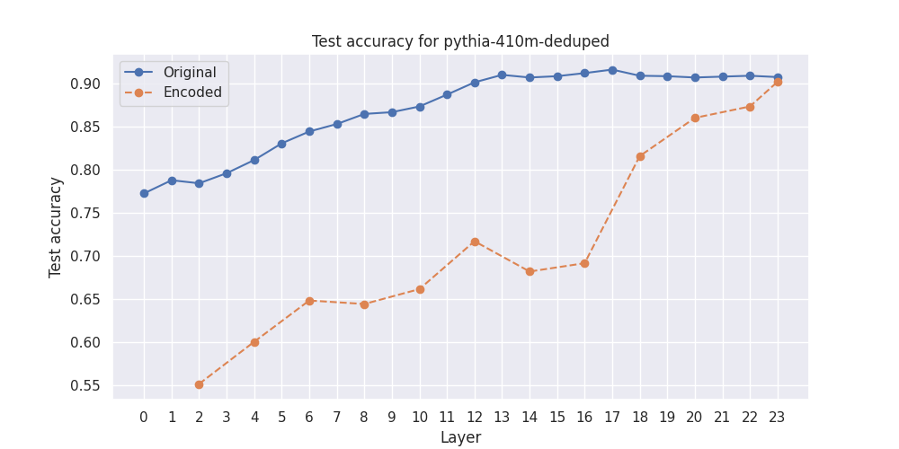
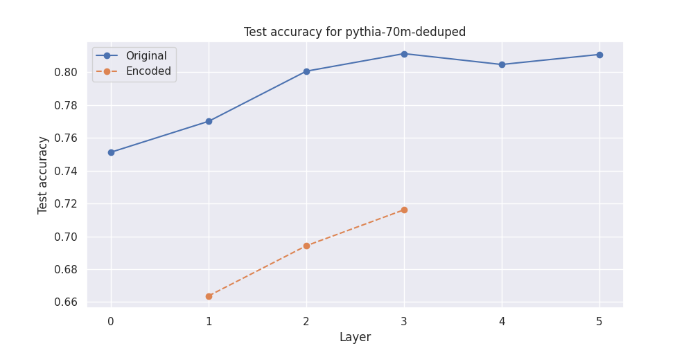

# Classification of IMDB data by using model hiddenstates and their sparse encodings

I'm interested in finding out if the sparse autoencoded representations are better for classification. The idea was inspired by [this paper](https://arxiv.org/pdf/2309.08600.pdf) and my [previous work](https://github.com/annahdo/exploring_directions).

### Install
You will have to clone the sparse coding repository to access the relevant class definitions. You also need to add the folder to your path.
```
git clone https://github.com/loganriggs/sparse_coding.git
```
In addition to that install the requirements
```
pip install -r requirements.txt
```
I tested with Python 3.11.5

## Usage

You can run the notebook with either `pythia-70m-deduped` or `pythia-410m-deduped` which are the two models for which I had access to pretrained [sparse](https://huggingface.co/Elriggs/pythia-410m-deduped) [autoencoders](https://huggingface.co/Elriggs/pythia-70m-deduped).

## Results

The sparse representations perform significantly worse on the classification task.



